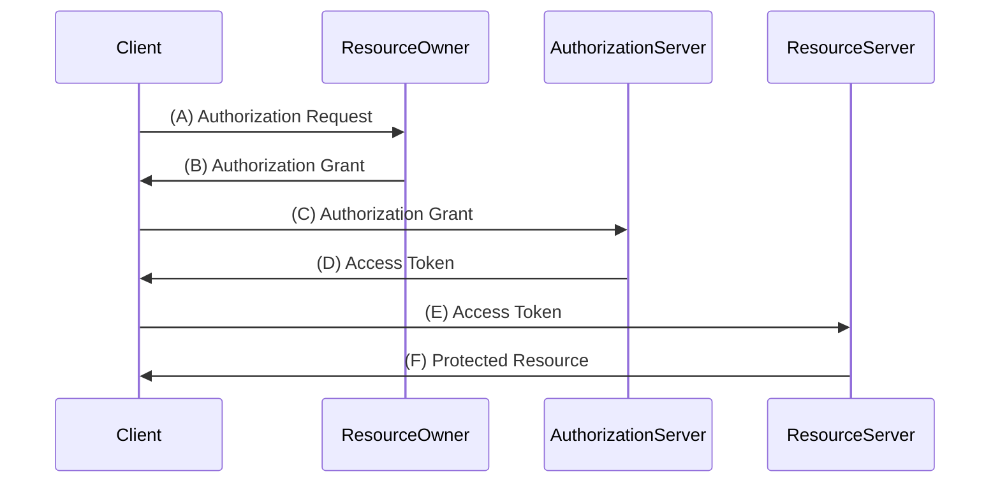

https://tex2e.github.io/rfc-translater/html/rfc6749.html
https://datatracker.ietf.org/doc/html/rfc6749


# The OAuth 2.0 Authorization Framework

## Abstract

The OAuth 2.0 authorization frameworks enables

For Whom?: a 3rd-party application 
What?: to obtain limited access to an HTTP service
How?: 
- A) on behalf of resource owner, by orchestrating an approval interaction between the reesource owner and the HTTP service
- B) by allowing allowing the 3rd-party application to obtain accesss on its own behalf


OAuth 2.0 Authorization framework は、
3rd party アプリケーションが、限定的なリクエストを得ることを許可する。

やり方) 
A. リソース所有者に代わって、リソース所有者とHTTPサービスの間のインタラクションを調整する
B. 3rd party アプリケーションが、自分自身の権限でアクセスを取得できるようにする


## 1. Introduction

従来のクラサバ認証モデルでは、クライアントはリソース所有者のcredentialsを利用して認証し、サーバー上のアクセス制限されたリソースをリクエストする。3rd party連携する場合は、リソース所有者はcredentialsを3rd partyアプリケーションに共有する必要がある。これにより、いくつかの問題と制限が生じる。

クラサバ認証 x 3rd party連携のやばい問題たち
- 3rd application は将来の使用のためにリソース所有者のcredentialsを保存する必要がある(e.g. 平文のパスワード)
- パスワードにはセキュリティ上の弱点があるにもかかわらず、サーバーはパスワード認証をサポートする必要がある
- 3rd party アプリケーションは、過度に広いアクセス権限を取得してしまう。
  - 期間を制限したり、リソースの限られたサブセットへのアクセスを制限したりできない。
- リソース所有者は、すべての3rd partyへのアクセスを取り消さない限り、、個々の3rd partyへのアクセスを制限できない
  - そのためにはパスワードの変更が必要
- 3rd party のアプリケーションが侵害されると、エンドユーザーのパスワードとそのパスワードによって保護されているすべてのデータが侵害される


OAuthは認可レイヤーを導入し、クライアントの役割をリソース所有者の役割から分離することにより、これらの問題に対処します。
OAuthでは、クライアントは、リソース所有者によって制御され、リソースサーバーによってホストされるリソースへのアクセスを要求し、リソース所有者のものとは異なる一連の資格情報(credentials)が発行されます。


> OAuthは認可レイヤーを導入し

これは後述するOAuth2.0のフローそのもの

> クライアントのRoleをリソース所有者のRoleから分離することにより、これらの問題に対処します

- 3rd partyアプリケーションに、ユーザーのフリをさせない。明確に区別する。
- 限定的な専用のアクセスチケットを渡す

> クライアントは、リソース所有者によって制御され

データの持ち主はユーザーである。3rd partyが勝手に権限を与えるのではなく、ユーザーの意思によってコントロールされる。

> リソースサーバーによってホストされるリソースへのアクセスを要求し、」


> リソース所有者のものとは異なる一連の資格情報(credentials)が発行されます

リソース所有者のもの = IDとパスワード
異なる一連の視覚情報 = 3rd party用のアクセストークン


アクセストークンは、リソース所有者の認可を得て、認可サーバーによってサードパーティのクライアントに発行される。
この仕様はHTTPを使うように設計されている。HTTP以外のプロトコルでのOAuthの使用は範囲外です。


### 1.1 Role

4つの役割が定義されている

- Resource Owner
  - 保護されたリソースへのアクセスを許可できるエンティティ
  - リソース所有者が個人である場合、それはエンドユーザーと呼ばれる
- Resource Server
  - 保護されたリソースをホストし、アクセストークンを使って リソースRequestを受け付ける
- Client
  - Resource Ownerに代わって、認可を得て、保護されたリソースリクエストを行うアプリケーション
  - * クライアントという用語は、その実装特性(デスクトップとか CLIとか)を表すものではない。
- Auhotirzation Server
  - Resource Ownerを認証し、クライアントにアクセストークンを発行するサーバー

* Authorization Server と Resource Server 間の相互作用はこの仕様


### 1.2 Protocol Flow

     +--------+                               +---------------+
     |        |--(A)- Authorization Request ->|   Resource    |
     |        |                               |     Owner     |
     |        |<-(B)-- Authorization Grant ---|               |
     |        |                               +---------------+
     |        |
     |        |                               +---------------+
     |        |--(C)-- Authorization Grant -->| Authorization |
     | Client |                               |     Server    |
     |        |<-(D)----- Access Token -------|               |
     |        |                               +---------------+
     |        |
     |        |                               +---------------+
     |        |--(E)----- Access Token ------>|    Resource   |
     |        |                               |     Server    |
     |        |<-(F)--- Protected Resource ---|               |
     +--------+                               +---------------+





### 1.3 Authorization Grant (認可付与)

認可付与は、クライアントがアクセストークンを取得するために使用する、リソース所有者の認可を表す資格情報の一種です。

### 1.4 Authorization Code (認可コード)
認可コードは、クライアントとリソース所有者の間の仲介として認可サーバーを使用し取得される。

リソース所有者に直接認可を要求する代わりに、
1. クライアントはリソース所有者を認可サーバーに誘導し
2. 次に認可コードとともにリソース所有者をクライアントに送り返す

リソース所有者を認可コードと共にクライアントに戻す前に、認可サーバーはリソース所有者を認証し、認可を取得する。
リソース所有者は認可サーバーでのみ認証するため、リソース所有者の視覚情報がクライアントと共有されることはない。

認可コードは、クライアントを認証する機能や、リソース所有者のユーザーエージェントを介さずにアクセストークンをクライアントに直接送信することで、リソース所有者を含む他者にアクセストークンがさらされる可能性を防ぐなど、いくつかの重要なセキュリティ上の利点を提供する。


### Q1. なぜ認可コードが必要なのか? 
まずなぜブラウザ(User Agent) は危険なのか? 
ブラウザはセキュリティ的には「誰に見られているかわからない場所」である(URL, ログ、ウイルス)
この表のルートで大事なアクセストークンを渡すことは極めて危険である。

そこで認可コード(引換券)である。
それ単体でけは役に立たない紙切れ(=認可コード)を、表のルート(ブラウザ)で渡す。

認可コードの特徴
- 有効期限が非常に短い(1~10分程度)
- 1度使ったら無効になる(ワンタイム)
- 最重要: これを鍵(アクセストークン)に交換するには、アプリの身分証明証(Client Secret)が必要

#### バックチャンネルでの交換

ブラウザが認可コードを3rd partyアプリに渡し終えたあと、
3rd partyアプリは「ユーザーのブラウザを介さずに」サーバー同士で直接通信を行う。
この通信はユーザーのブラウザという広場を通らない。

ここではじめて 3rd partyアプリは以下の3点セットを提示する。
- 認可コード
- Client ID
- Client Secret

認可サーバーはこの3つが完璧に揃ったことを確認してはじめて「アクセストークン」をアプリのサーバーに直接渡す


#### まとめ

大事な鍵(アクセストークン)は、危険なブラウザ(ユーザーエージェント)を通さずに、
安全な裏ルート(直接送信)だけで受け渡しをしたい。そのために敢えて引換券(認可コード)というワンクッションを挟む。

このおかげで仮にブラウザの通信が全て見られていたとしても、見られるのは役に立たない引換券だけで、本物の鍵は安全に守られる。

#### ちなみに

ブラウザを信頼できないとする根拠は、
RFC6749 Section 2.1 や FC6819 に書いてある

#### RFFC6749 Section 2.1

クライアントを以下の2つに分類

- Confidential Client
    - Webサーバーで動くアプリなど
    - 「パスワード(Client Secret)」を安全に隠し持てる」と定義
    - ユーザーがや外部からはサーバーの中身が見えないため「信頼できる」と定義される
- Public Client
    - ブラウザ上で動くJavaScriptアプリ(SPA)や、スマホのネイティブアプリなど
    - 「パスワード(Client Secret)を安全に隠し持てない」と定義
    - ソースコードが’ユーザーのデバイスにDownloadされて実行するため、ソースを表示やデコンパイルが可能


#### RFC6819 OAuth 2.0 Thread Model and Security Considerations

どんな攻撃が想定されるのか? という脅威モデルを専門に扱った文書


### 1.3.2 Implicit Grant 

JavaScriptなどのスクリプト言語を使用してブラウザに実装されたクライアント用に最適化された、単純化された認可コードフロー。Authorization Code を発行する代わりに、クライアントに直接アクセストークンを発行する。

セキュリティ影響があるのでこのデメリットと比較が必要。
基本非推奨と考えても良い。


### 1.4 アクセストークン

アクセストークンは保護されたリソースへのアクセスに使用される資格情報です。
この仕様は https://tex2e.github.io/rfc-translater/html/rfc6750.html にて定義されている

## 2. Client 登録

クライアントが認可サーバーに登録する方法はこの仕様の範囲外である

ただし以下は必要だろう
- client type の指定
- client redirect uri の指定
- 認可サーバーに必要なその他の情報(アプリケーション名、ウェブサイト名、ロゴ、説明、法的条件の承諾など)


## 2.1 Client Type

- confidential
  - 要はサーバー
- public
  - 要はブラウザSPAやスマホアプリなど

## 2.2 Client Identifier

認可サーバーはクライアントIDを発行する。
ClientIDは秘密情報ではない。
これ単独でクライアント認証に利用してはならない。
Client ID は認可サーバーに対してuniqueである。

## 2.3 Client Authentication

> クライアントの種類が機密である場合、クライアントと認可サーバーは、認可サーバーのセキュリティ要件に適したクライアント認証方法を確立します。認可サーバーは、セキュリティ要件を満たすあらゆる形式のクライアント認証を受け入れることができます。

confidential client ならば、事前にくアライアント認証方式を決めておけよ。
セキュリティ要件を満たしていればどんな方式でもよいよ。

> 機密クライアントは通常、認可サーバーでの認証に使用されるクライアント資格情報のセット（パスワード、公開/秘密キーのペアなど）を発行（または確立）します。

confidential client は通常、認可サーバーへのclient credentials のsetを発行される (e.g. パスワード、public/private key pair)


> 認可サーバーは、公開クライアントとのクライアント認証方法を確立してもよい（MAY）。ただし、認可サーバーは、クライアントを識別する目的でパブリッククライアント認証に依存してはなりません（MUST NOT）。

public client は clientId/secret で認証することもできるが、信頼できない。
まずclientId は機密情報ではないため詐称可能。
そしてpublic clientはその定義より、clientSecretを安全に隠しもてないため、clientSecretも詐称可能(簡単に漏洩する)
public client認証に依存することは、セキュリティレベルを下げることである。

識別以外にclientIDを使いたいのどういうケースがあるの? 
- 統計やログ・分析のために使うにはいいかもね
- rateLimit制限のため

備考: public client で OAuth2.0 やりたいなら 
- PKCE(https://tex2e.github.io/rfc-translater/html/rfc7636.html)を使うか
- BFFというconfidential clientを挟んでOAuth2.0フローをやるのが

> 各クライアントは、それぞれのリクエストで複数の認証方法を利用してはならない

それはそう

## 2.3.1 Client Password

Client Password(client secret) を所持しているクライアント(=confidential client)は、
Basic認証(RFC2617)でクライアント認証してよいよ。application/x-www-form-urlencoded エンコーディングアルゴリズムをつかって clientId/clientSecret または userId/password をエンコードしてね。

別の方法として、リクエストボディにclient credentialsを含めてもよいよ。
client_id: 必須
client_secret: 必須
ただし2つのパラメータを使用してリクエストボディにclient credentialsを含めることは推奨されていないよ。
なので HTTP Basic authentication scheme が使えないclientに対してのみ、リクエストボディ形式を使用することが推奨されているよ

あとTLSは必須だよ。


## 2.4 未登録クライアント

未登録クライアントをどうするかはこの仕様の範囲外です


## 3. プロトコルエンドポイント

この認可プロセスは2つの認可サーバーエンドポイントを利用します

- authorization endoint
  - クライアントがユーザーエージェントリダイレクトを介してリソース所有者から認可を取得するために利用する
- token endpoint
  - クライアント認証を使って、認可付与(Authorization Grant)をアクセストークンに交換するために利用する

クライアントエンドポイントも1つ必要です
- redirect endpoint
  - リソース所有者のユーザーエージェントを介して、認可資格情報を含むレスポンスをクライアントに返すために認可サーバーによって使用される


※すべての認可付与タイプ(Authorization Grant Type)が両方のエンドポイントを必要とするわけではないことに注意してください


Q. Client登録時にgrant_typeって持たないの? 
A. 仕様では明記されていないが、権限の最小化の観点で保持しておくべきだろう。


## 3.1 認可エンドポイント

リソース所有者と対話し、認可付与(Authorization Grant)を取得するためのエンドポイント
認可サーバーは最初に身元を確認する必要がある。
認可サーバーがリソース所有者を認証する方法はこの仕様の範囲外である


## 3.1.1 Response Type

認可エンドポイントは、
- Auhotization Code Grant Type
- Implicit Grant Type
によって利用される

- response_type = code | token |  または８.4で説明する登録済みの値


## 3.1.2 Redirect Endpoint

認可サーバーは事前に確立されたRedirect Endpointにユーザーエージェントをリダイレクトする


認可サーバーはクライアントが複数のリダイレクトURIを登録できるようにする場合がある(MAY)


複数のリダイレクトURIが登録されている場合や、リダイレクトURIが登録されていない場合は、
認可サーバーはリダイレクトURIをクライアントからの認可リクエストで受け入れる必要がある(MUST)


## 3.1.2.4  無効なRedirect URI

無効なRedirect URI が提供された場合、認可サーバーはエラーを通知する必要がある(SHOULD)
無効なURIにリダイレクトしてはいけない。

## 3.2 Token Endpoint

Token Endpoint はクライアントが認可付与(Authorization Grant)、またはリフレッシュトークンを提示して、
アクセストークンを取得するためのエンドポイントです。

Token Endpoint は、Implicit Grantを除くすべてのGrantTypeで使用されます。

## 3.2.1 Client Authentication

Confidential Client または Client Credential を発行した他のClientは、
Token Endpointにリクエストを行う時に、
セクション2.3で説明されているように、認可サーバーで認証する必要があります

クライアント認証は次の目的で使用されます
- リフレッシュトークンと認可コードを、それらが発行されたクライアントに強制的にバインドする。
- クライアント認証は、認可コードが安全でないチャネル(=Front Channel)を介してリダイレクトエンドポイントに送信される場合、またはリダイレクトURIが完全に登録されていない場合に重要です。
  - client_secret と 認可コードの組み合わせがないとクライアント認証しないよ、という意味
- クライアントの無効化または資格情報の変更により、侵害されたクライアントから回復し、攻撃者が盗まれたリフレッシュトークンを悪用するのを防ぎます。単一セットのクライアント視覚情報の変更は、リフレッシュトークンのセット全体を消すよりも大幅に高速です。
- 定期的な認証情報のローテーションを必要とする、認証管理のベストプラクティスを実装します。リフレッシュトークンのセット全体のローテーションは難しい場合がありますが、クライアント資格情報の単一セットのローテーションは非常に簡単です。

Q. バインドって永続化?
A. だいたいそうだが、必ずしもそうではない。


```
{
    "client_id": "アプリA",
    "user_id": "ユーザー鈴木",
    "redirect_uri": "https://app-a.com/callback",
    "nonce": "random..."
}
```

こういう感じのpayloadを認可コード自体に暗号化して含める。
秘密鍵は認可サーバーのみが知っている状態にしておく。
これは割とモダンらしい。


クライアントは、リクエストをトークンエンドポイントに送信するときに、「client_id」リクエストパラメータを使用して自身を識別することができます。トークンエンドポイントへの "authorization_code" "grant_type"リクエストでは、認証されていないクライアントがその "client_id"を送信して、別の "client_id"を持つクライアント向けのコードを誤って受け入れないようにする必要があります。これにより、認可コードの置換からクライアントが保護されます。 （保護されたリソースに追加のセキュリティは提供されません。）


## 3.3 アクセストークンのスコープ

> 認可サーバーは、認可サーバーのポリシーまたはリソース所有者の指示に基づいて、クライアントによって要求されたスコープを完全にまたは部分的に無視する場合があります。

- 認可サーバーのポリシーに基づいて =  e.g. この3rd partyアプリにはこのスコープは与えないよ、という設定値
- リソース所有者の指示に基づいて = チェックボックス


> クライアントが認可をリクエストするときにスコープパラメータを省略した場合、認可サーバーは、事前定義されたデフォルト値を使用してリクエストを処理するか、無効なスコープを示すリクエストに失敗する必要があります。認可サーバーは、そのスコープ要件とデフォルト値（定義されている場合）を文書化する必要があります（SHOULD）。


## 4. 認可の取得

アクセストークンを要求するために、クライアントはリソース所有者から認可を取得する。
認可は、クライアントがアクセストークンを要求するために使用する認可付与の形式で表されます。

- Authorization Code Grant
- Implicit Grant
- Resource Owner Password Credentials Grant
- Client Credentials Grant
の４つがある。
また、追加のGrant Typeを拡張するメカニズムも提供している。


## 4.1 Authoriation Code Grant

- Access Token と Refresh Token の両方を取得するために使用される
- Confidential Clientに最適化されている


Q. client_secret 単体でアクセストークンを発行しないのはなぜ?
A. client_secret は3rd partyアプリの身分証明であって、ユーザーの認可を表すもの(許可証)ではないから。

もし client_secret 単体でアクセストークンを発行できるとしたら、3rd partyアプリが勝手にユーザーの許可を得放題になってしまう。

Q. だから認可コードは1回しか使えない? 
A. Yes。ちなみに2回使われたら、攻撃とみなされすべてリセットするらしい。

Q. でもリフレッシュトークンがあれば3rd pary appはやり放題じゃん。
A. Yes．
https://auth-wiki.logto.io/ja/offline-access オフラインアクセスという仕様で定義されている。

- Scopeによって制限されている
- ユーザーが強制解除できる
ことによって許容可能、という考え方になっている。


さらにGoogleとかは、
- 異常検知: もしアプリが、必要もないのに**「1秒間に100回リフレッシュトークンを使う」**ような異常な挙動をしたら、サーバーは自動的にそのアプリをブロック（BAN）します。
- トークン有効期限: 一部の厳しいサービス（金融系など）では、リフレッシュトークン自体に「最大90日まで」といった絶対的な有効期限を設けて、強制的に再ログインを求める場合もあります。


     +----------+
     | Resource |
     |   Owner  |
     |          |
     +----------+
          ^
          |
         (B)
     +----|-----+          Client Identifier      +---------------+
     |         -+----(A)-- & Redirection URI ---->|               |
     |  User-   |                                 | Authorization |
     |  Agent  -+----(B)-- User authenticates --->|     Server    |
     |          |                                 |               |
     |         -+----(C)-- Authorization Code ---<|               |
     +-|----|---+                                 +---------------+
       |    |                                         ^      v
      (A)  (C)                                        |      |
       |    |                                         |      |
       ^    v                                         |      |
     +---------+                                      |      |
     |         |>---(D)-- Authorization Code ---------'      |
     |  Client |          & Redirection URI                  |
     |         |                                             |
     |         |<---(E)----- Access Token -------------------'
     +---------+       (w/ Optional Refresh Token)


(A)  クライアントは、リソース所有者のユーザーエージェントを認証するエンドポイントに送信することでフローを開始します。

クライアントには、
- Client ID
- Requested Scope
- Local State
- Redirect URI
が含まれます

(B) 認可サーバーはリソースオーナーを(ユーザーエージェント経由で)認証し、リソースオーナーがクライアントのアクセス要求を許可するか拒否するかを確立します

(C) リソースの所有者がアクセスを許可すると、認可サーバーは事前に提供されたリダイレクトURIを使用してユーザーエージェントをクライアントにリダイレクトします。リダイレクトURIには、認可コードと事前にクライアントによって提供されたローカル状態が含まれます

（D）クライアントは、前のステップで受信した認可コードを含めることにより、認可サーバーのトークンエンドポイントにアクセストークンを要求します。要求を行うとき、クライアントは認可サーバーで認証します。クライアントには、検証用の認可コードを取得するために使用されるリダイレクトURIが含まれています。

（E）認可サーバーはクライアントを認証し、認可コードを検証し、受信したリダイレクトURIがステップ（C）でクライアントをリダイレクトするために使用されたURIと一致することを確認します。有効な場合、認可サーバーはアクセストークンと、オプションでリフレッシュトークンで応答します。

## 4.1.1 Authorization Request

applicaion/x-www-form-urlencoded 形式を使って、認可エンドポイントに次のパラメータを追加する

- response_type: code (必須)
- client_id (必須)
- redirect_uri (optional)
- scope (optional)
- state (recommended)
  - リクエストとコールバックの間の状態を維持するためにクライアントが利用する不透明な値
  - ユーザーエージェントをクライアントにリダイレクトする際にこの値を含める
  - CSRFを防ぐためにこのパラメーターは使われるべきである(SHOULD)

クライアントは HTTP Redirect を利用して、またはユーザーエージェントを介してリソース所有者が利用できる他の方法で、リソース所有者を構築されたURIに誘導する。

```
   GET /authorize?response_type=code&client_id=s6BhdRkqt3&state=xyz
        &redirect_uri=https%3A%2F%2Fclient%2Eexample%2Ecom%2Fcb HTTP/1.1
    Host: server.example.com
```

認可サーバーは要求を検証して、必要なすべてのパラメータが存在し有効であることを確認する。
要求が有効である場合、認可サーバーはリソース所有者を認証し、
(リソース所有者に尋ねるか、または他の手段で認可を確立することによって) 認可決定を取得します。

決定が確立されると、認可サーバーはHTTP Reirectを利用して、ユーザーエージェントを転送します。

## 4.1.2 Authorization Response

application/x-www-form-urlencoded 形式をつかって、リダイレクトURIに次のパラメータを追加する

- code (必須)
  - 認可コード
  - 最長有効期間は10分
  - 認可コードは1回しか使えない。
    - 2回以上使われたら要求を拒否し(MUST)、
    - その認可コードに基づいて以前に発行されたすべてのトークンを(可能な場合は)取り消す必要がある(SHOULD
  - 認可コードはClientIDとリダイレクトURIにバインドされている
- state (リクエストに存在する場合は必須) 
  


```
   HTTP/1.1 302 Found
     Location: https://client.example.com/cb?code=SplxlOBeZQQYbYS6WxSbIA
               &state=xyz
```


認可コードの文字列のサイズはこの使用では未定義
認可サーバーは発行する値のサイズを文書化するべき(SHOULD)

Q. stateってなに? 
A. CSRF対策
  - サーバーで生成するか、Clientが生成するかは問わない


CSRF: 「自分が被害者のアカウントを乗っ取る」のではなく、「被害者を、無理やり『攻撃者のアカウント』でログインさせてしまう」 という、逆転の発想を使った攻撃です。

CSRF対策: リクエストを投げた人と、帰ってきた人が同一人物であることを確認する


Q. stateでなぜ防げるか? 
- あなたがリンクを踏む。
- 通販サイトは state をチェックする。
- 「あれ？ この code は攻撃者が発行したものだけど、あなたのブラウザには攻撃者が作った state （合言葉）が保存されていないぞ？」
- 「これは不正なリクエストだ！」と判断してエラーにする。

Q. ブラウザはstateをどこに保存するの? 
A. Cookie か Session Storage  


## 4.1.2.1 Error Response

リダイレクトURIの欠落、無効、または不一致が原因で要求が失敗した場合、またはクライアントIDが欠落しているか無効である場合、認可サーバーはリソース所有者にエラーを通知する必要があり（SHOULD）、ユーザーエージェントを無効なリダイレクトに自動的にリダイレクトしてはなりません（MUST NOT）。 URI。


- error (REQUIRED). A single ASCII [USASCII] error code from the following:
  - invalid_request
    - パラメータの欠落、無効なパラメータ、パラメータが2回以上含まれているなｄ
  - unauthorized_request
    - clientはこのメソッドを使用して認可コードをリクエストすることが許可されていない
  - access_denied
    - リソース所有者または認可サーバーがリクエストを拒否しました
  - unsupported_response_type
    - 認可サーバーはこのメソッドを利用したんっかコードの取得をサポートしていません
  - invalid_scope:
    - リクエストされたスコープは無効、不明、または不正な形式
  - server_error
    - 認可サーバーが予期しない条件を検出したため
    - (HTTP status 500をリダイレクト経由で返せないためこのエラーコードが必要)
  - temporailly_unavailable
    - サーバーの一時的な過負荷やメンテナンスのため利用できない 
    - (HTTP status 503をリダイレクト経由で返せないためこのエラーコードが必要)
- error_description (Optional)
- error_uri (Optional)
  - エラーに関する情報を含む人間が読めるWebページのURI
- state (もしstateがリクエストに存在する場合 Required)
  

## 4.1.3 Access Token Request


以下のパラメータをapplication/x-www-form-urlencoded形式に含める

- grant_type (必須): authorization_code
- code (必須): 認可コード
- redirect_uri (認可リクエストに含まれている場合、必須): 
  - 認可リクエストとAccess Token Requestのredirect_uriの値は一致する必要がある
- client_id (clientが認可サーバーで認証されていない場合、必須):


## 4.1.4 Access Token Response

```
     HTTP/1.1 200 OK
     Content-Type: application/json;charset=UTF-8
     Cache-Control: no-store
     Pragma: no-cache

     {
       "access_token":"2YotnFZFEjr1zCsicMWpAA",
       "token_type":"example",
       "expires_in":3600,
       "refresh_token":"tGzv3JOkF0XG5Qx2TlKWIA",
       "example_parameter":"example_value"
     }
```


